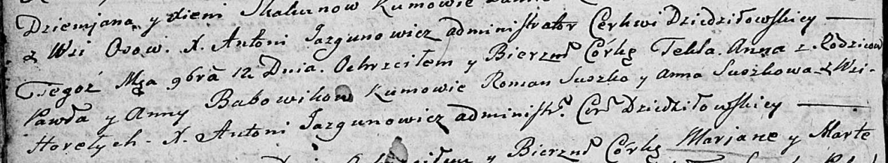

**Бобовик Текля Павлова (Babowikowna Tekla Anna)**

12 сентября 1805 г -- крещение (НИАБ 136-13-894, лист 58, №54/1805-р
(ориг)).

**НИАБ 136-13-894:** Лист 58. **Метрическая запись №54/1805-р (ориг).**

{width="6.496527777777778in"
height="1.1981933508311462in"}

Дедиловичская Покровская церковь. 12 ноября 1805 года. Метрическая
запись о крещении.

Babowikowna Tekla Anna -- дочь родителей с деревни Горелое.

Babowik Paweł -- отец.

Babowikowa Anna -- мать.

Suszko Roman -- кум.

Suszkowa Anna -- кума.

Jazgunowicz Antoni -- ксёндз.
