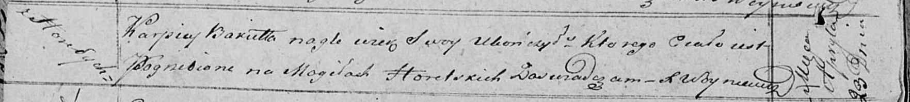

**Бокет Карпей (Bakiet Karpiey)**

23 апреля 1821 г -- отпевание (НИАБ 136-13-919, лист 34об, №6/1821-у
(ориг)).

**НИАБ 136-13-919:** Лист 34об. **Метрическая запись №6/1821-у (ориг).**

Осовская униатская церковь. 23 апреля 1821 года. Метрическая запись об
отпевании.

Bakiet Karpiey -- умер внезапно, с деревни Горелое, похоронен на
кладбище деревни Горелое.

Woyniewicz Tomasz -- ксёндз.
