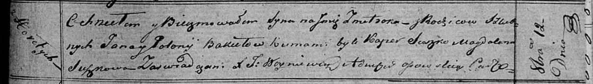

**Бокет Змитрок Янов (Bokiet Zmitrok)**

12 октября 1819 г -- крещение (НИАБ 136-13-894, лист 103, №54/1819-р
(ориг)).

**НИАБ 136-13-894:** Лист 103. **Метрическая запись №54/1819-р (ориг).**

{width="6.496527777777778in"
height="0.9306616360454943in"}

Осовская Покровская церковь. 12 октября 1819 года. Метрическая запись о
крещении.

Bokiet Zmitrok -- сын родителей с деревни Горелое.

Bokiet Jan -- отец.

Bokietowa Połonija -- мать.

Suszko Kasper -- кум.

Suszkowa Magdalena -- кума.

Woyniewicz Tomasz -- ксёндз.
