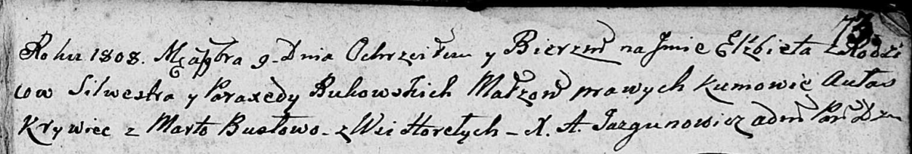

**Буковский Сильвестр (Bukowski Silwester)**

9 ноября 1808 г -- крещение дочери Елисаветы (НИАБ 136-13-894, лист 73,
№42/1808-р (ориг)).

**НИАБ 136-13-894:** Лист 73. **Метрическая запись №42/1808-р (ориг).**

{width="6.496527777777778in"
height="1.0989588801399826in"}

Дедиловичская Покровская церковь. 9 ноября 1808 года. Метрическая запись
о крещении.

Bukowska Elżbieta -- дочь родителей с деревни Горелое.

Bukowski Silwester -- отец.

Bukowska Paraxieda -- мать.

Krywiec Aułas -- кум.

Busłowa Marta -- кума.

Jazgunowicz Antoni -- ксёндз.
