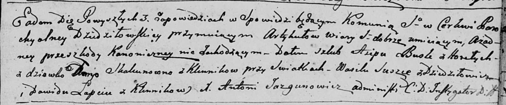
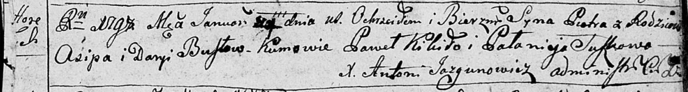
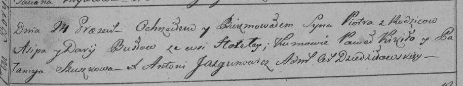
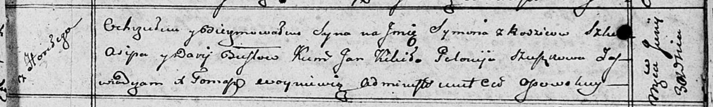

**Бусел (Скакун) Дарыя (Busłowa Daryia z Skakunow)**

11 января 1797 г -- венчание с Асипом Буслой с деревни Горелое (НИАБ
136-13-920, лист 4, №2/1797-б (ориг)).

24 сентября 1798 г -- крещение сына Петра (НИАБ 136-13-894, лист 35,
№4/1798-р (ориг)), (РГИА 823-2-18, лист 262, №4/1798-р (коп)).

30 июня 1810 г -- крещение сына Сымона (НИАБ 136-13-894, лист 78,
№25/1810-р (ориг)).

**НИАБ 136-13-920:** Лист 4. **Метрическая запись №2/1797-б (ориг).**

Дедиловичская Покровская церковь. 11 января 1797 года. Метрическая
запись о венчании.

Busła Asip -- жених, с деревни Горелое.

Skakunowna Daryja -- невеста, девка с деревни Клинники.

Suszko Wasil -- свидетель, с деревни Дедиловичи.

Łapiec Dawid -- свидетель, с деревни Клинники.

Jazgunowicz Antoni -- ксёндз.

**НИАБ 136-13-894:** Лист 35. **Метрическая запись №4/1798-р (ориг).**

Дедиловичская Покровская церковь. 24 января 1798 года. Метрическая
запись о крещении.

Busło Piotr -- сын родителей с деревни Горелое.

Busło Asip -- отец.

Busłowa Daryia -- мать.

Kikiło Paweł - кум.

Suszkowa Pałanieja - кума.

Jazgunowicz Antoni -- ксёндз.

**РГИА 823-2-18:** Лист 262. **Метрическая запись №4/1798-р (коп).**

Дедиловичская Покровская церковь. 24 января 1798 года. Метрическая
запись о крещении.

Busło Piotr -- сын родителей с деревни Горелое.

Busło Asip -- отец.

Busłowa Darija -- мать.

Kikiło Paweł -- кум.

Szuszkowa Pałanieja -- кума.

Jazgunowicz Antoni -- ксёндз.

**НИАБ 136-13-894:** Лист 78. **Метрическая запись №25/1810-р (ориг).**

Осовская Покровская церковь. 30 июня 1810 года. Метрическая запись о
крещении.

Busła Symon -- сын родителей с деревни Горелое.

Busła Asip -- отец.

Busłowa Darya -- мать.

Kikiło Jan -- кум.

Szuszkowa Połonieja -- кума.

Woyniewicz Tomasz -- ксёндз.
