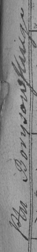

**Бусел Пётр Асипов (Busła Piotr)**

24 сентября 1798 г -- крещение (НИАБ 136-13-894, лист 35, №4/1798-р
(ориг)), (РГИА 823-2-18, лист 262, №4/1798-р (коп)).

**НИАБ 136-13-894:** Лист 35. **Метрическая запись №4/1798-р (ориг).**

{width="6.496527777777778in"
height="0.8797036307961504in"}

Дедиловичская Покровская церковь. 24 января 1798 года. Метрическая
запись о крещении.

Busło Piotr -- сын родителей с деревни Горелое.

Busło Asip -- отец.

Busłowa Daryia -- мать.

Kikiło Paweł - кум.

Suszkowa Pałanieja - кума.

Jazgunowicz Antoni -- ксёндз.

**РГИА 823-2-18:** Лист 262. **Метрическая запись №4/1798-р (коп).**

{width="6.496527777777778in"
height="1.2083333333333333in"}

{width="0.5625in"
height="3.7604166666666665in"}

Дедиловичская Покровская церковь. 24 января 1798 года. Метрическая
запись о крещении.

Busło Piotr -- сын родителей с деревни Горелое.

Busło Asip -- отец.

Busłowa Darija -- мать.

Kikiło Paweł -- кум.

Szuszkowa Pałanieja -- кума.

Jazgunowicz Antoni -- ксёндз.
