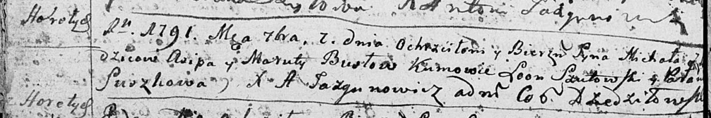
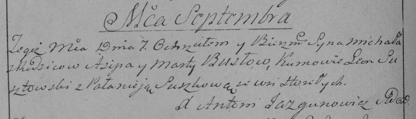

**Бусел Михал Асипов (Busła Michał)**

7 сентября 1791 г -- крещение (НИАБ 136-13-894, лист 13об, №41/1791-р
(ориг)), (РГИА 823-2-18, лист 242, №20/1791-р (коп)).

**НИАБ 136-13-894:** Лист 13об. **Метрическая запись №41/1791-р
(ориг).**

Дедиловичская Покровская церковь. 7 сентября 1791 года. Метрическая
запись о крещении.

Busła Michał -- сын родителей с деревни Горелое.

Busła Asip -- отец.

Busłowa Maruta -- мать.

Szutowski Leon - кум.

Suszkowa Pałania - кума.

Jazgunowicz Antoni -- ксёндз.

**РГИА 823-2-18:** Лист 242об. **Метрическая запись №20/1791-р (коп).**

Дедиловичская Покровская церковь. 7 сентября 1791 года. Метрическая
запись о крещении.

Busło Michał -- сын родителей с деревни Горелое.

Busło Asip -- отец.

Busłowa Marta -- мать.

Susztowki Leon -- кум.

Suszkowa Pałanieja - кума.

Jazgunowicz Antoni -- ксёндз.
