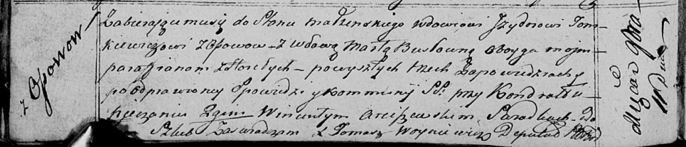

**Томкович (в предыдущем браке Бусел) Марта (Tomkiewiczowa (Busłowna)
Marta)**

11 ноября 1817 г -- венчание с вдовцом Изыдором Томковичем с деревни
Осово (НИАБ 136-13-920, лист 24об, №13/1817-б (ориг)).

**НИАБ 136-13-920:** Лист 24об. **Метрическая запись №13/1817-б
(ориг).**

{width="6.496527777777778in"
height="1.3933103674540683in"}

Осовская Покровская церковь. 11 ноября 1817 года. Запись о венчании.

Tomkiewicz Jzydor -- жених, вдовец, парафии Осовской, с деревни Осово.

Busłowna Marta -- невеста, вдова, парафии Осовской, с деревни Горелое.

Pieczań Kondrat -- свидетель.

Arciszewski Wincenty -- свидетель.

Woyniewicz Tomasz -- ксёндз.
