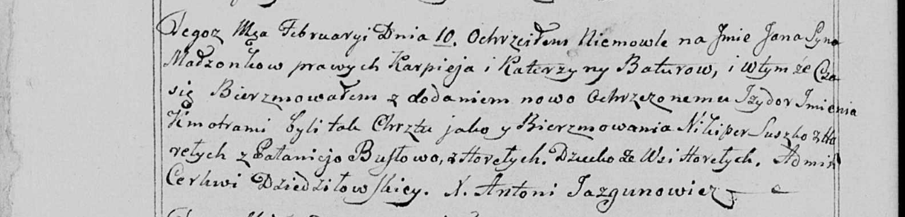

**Лапец (Бусло) Аполония, Палюха (Lapciowa Apołonija, Palucha z
Busłow)**

10 февраля 1799 г -- крестная мать Яся, сына Батур Карпея и Катерины с
деревни Нивки (НИАБ 136-13-938, лист 240об, №6/1799-р (коп)).

10 сентября 1800 г -- венчание с Гаврилой Лапецом с деревни Клинники
(НИАБ 136-13-920, лист 7, №6/1800-б (ориг)).

**НИАБ 136-13-920:** Лист 7. **Метрическая запись №6/1800-б (ориг).**

{width="6.496527777777778in"
height="1.723869203849519in"}

Дедиловичская Покровская церковь. 10 сентября 1800 года. Метрическая
запись о венчании.

Łapac Gabriel -- жених, с деревни Клинники.

Busłowa Palucha -- невеста, девка с деревни Горелое.

Suszko Chwiedor -- свидетель.

Harauczyk Marko -- свидетель.

Jazgunowicz Antoni -- ксёндз.

**НИАБ 136-13-894:** 240об. **Метрическая запись №6/1799-р (коп).**

(См. тж. НИАБ 136-13-894, лист 38, №6/1799-р (ориг); РГИА 823-2-18, лист
268, №6/1799-р (коп))

{width="6.496527777777778in"
height="1.5618055555555554in"}

Дедиловичская Покровская церковь. 10 февраля 1799 года. Метрическая
запись о крещении.

Batura Jan Jzydor -- сын родителей с деревни Горелое \[Нивки\].

Batura Karpiey -- отец.

Baturowa Katerzyna -- мать.

Suszko Nikiper -- кум, с деревни Горелое.

Busłowa Pałanieja - кума, с деревни Горелое.

Jazgunowicz Antoni -- ксёндз.
