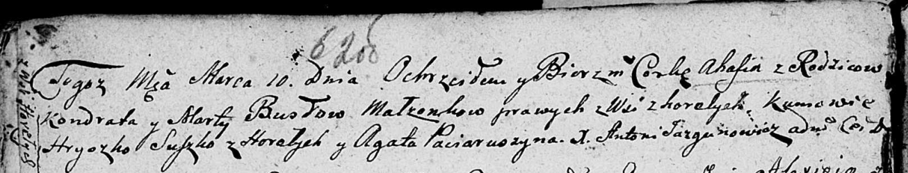

**Бусел Агафия Кондратова (Busłowna Ahafia)**

10 марта 1807 г -- крещение (НИАБ 136-13-894, лист 62об, №17/1807-р
(ориг)).

**НИАБ 136-13-894:** Лист 62об. **Метрическая запись №17/1807-р
(ориг).**

Дедиловичская Покровская церковь. 10 марта 1807 года. Метрическая запись
о крещении.

Busłowa Ahafia -- дочь родителей с деревни Горелое.

Busła Kondrat -- отец.

Busłowa Marta -- мать.

Suszko Hryszko -- кум, с деревня Горелое.

Paciaruszyna Agata -- кума.

Jazgunowicz Antoni -- ксёндз.
