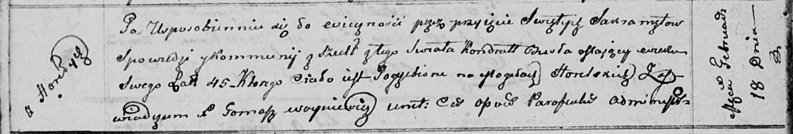

**Бусел Кондрат (Busła Kondrat)**

10 ноября 1801 г -- венчание с Мартой Шчыпак с деревни Горелое (НИАБ
136-13-920, лист 7об, №5/1801-б (ориг)).

10 марта 1807 г -- крещение дочери Агафия (НИАБ 136-13-894, лист 62об,
№17/1807-р (ориг)).

18 февраля 1811 г -- отпевание, умер в возрасте 45 лет (родился около
1766 г) (НИАБ 136-13-919, лист 22об, №6/1811-у (ориг)).

**НИАБ 136-13-920:** Лист 7об. **Метрическая запись №5/1801-б (ориг).**

{width="6.496527777777778in"
height="1.2826771653543307in"}

Дедиловичская Покровская церковь. 10 ноября 1801 года. Метрическая
запись о венчании.

Busła Kondrat -- жених.

Szczypakowna Marta -- невеста, с деревни Горелое.

Busła Asip -- свидетель.

Sawicki Paweł -- свидетель.

Jazgunowicz Antoni -- ксёндз.

**НИАБ 136-13-894:** Лист 62об. **Метрическая запись №17/1807-р
(ориг).**

{width="6.496527777777778in"
height="1.2437871828521434in"}

Дедиловичская Покровская церковь. 10 марта 1807 года. Метрическая запись
о крещении.

Busłowa Ahafia -- дочь родителей с деревни Горелое.

Busła Kondrat -- отец.

Busłowa Marta -- мать.

Suszko Hryszko -- кум, с деревня Горелое.

Paciaruszyna Agata -- кума.

Jazgunowicz Antoni -- ксёндз.

**НИАБ 136-13-919:** Лист 22об. **Метрическая запись №6/1811-у (ориг).**

{width="6.496527777777778in"
height="1.1027777777777779in"}

Осовская униатская церковь. 18 февраля 1811 года. Метрическая запись об
отпевании.

Busła Kondrat -- умерший, 45 лет, с деревни Горелое, похоронен на
кладбище деревни Горелое.

Woyniewicz Tomasz -- ксёндз.
