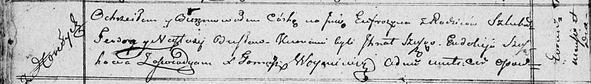

**Бусел Евфрозына Теодорова (Busłowna Eufrozyna)**

18 сентября 1810 г -- крещение (НИАБ 136-13-894, лист 78об, №39/1810-р
(ориг)).

**НИАБ 136-13-894:** Лист 78об. **Метрическая запись №39/1810-р
(ориг).**

{width="6.496527777777778in"
height="0.9326727909011373in"}

Осовская Покровская церковь. 18 сентября 1810 года. Метрическая запись о
крещении.

Busłowna Eufrozyna -- дочь родителей с деревни Горелое.

Busła Teodor -- отец.

Busłowa Nastazya -- мать.

Szuszko Jhnat -- кум.

Szuszkowa Ewdoija -- кума.

Woyniewicz Tomasz -- ксёндз.
