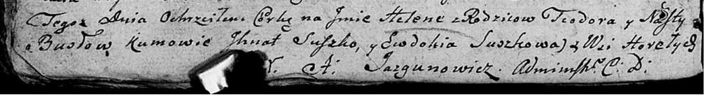

**Бусел Елена Теодорова (Busłowna Helena)**

27 ноября 1805 г -- крещение (НИАБ 136-13-894, лист 58, №59/1805-р
(ориг)).

**НИАБ 136-13-894:** Лист 58. **Метрическая запись №59/1805-р (ориг).**

{width="6.496527777777778in"
height="0.8776913823272091in"}

Дедиловичская Покровская церковь. 27 ноября 1805 года. Метрическая
запись о крещении.

Busłowna Helena -- дочь родителей с деревни Горелое.

Busła Teodor -- отец.

Busłowa Nasta -- мать.

Suszko Jhnat -- кум.

Suszkowa Ewdokia -- кума.

Jazgunowicz Antoni -- ксёндз.
