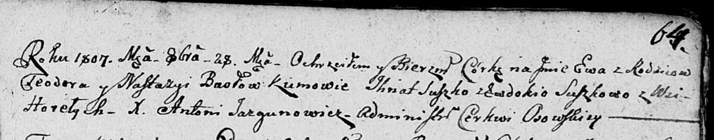

**Бусел Теодор (Busła Teodor)**

12 ноября 1804 г -- венчание с Настой Паушко с деревни Нивки (НИАБ
136-13-920, лист 11, №11/1804-б (ориг)).

27 ноября 1805 г -- крещение дочери Елены (НИАБ 136-13-894, лист 58,
№59/1805-р (ориг)).

28 октября 1807 г -- крещение дочери Евы (НИАБ 136-13-894, лист 64,
№45/1807-р (ориг)).

18 сентября 1810 г -- крещение дочери Евфрозыны (НИАБ 136-13-894, лист
78об, №39/1810-р (ориг)).

8 ноября 1813 г -- крещение дочери Марьяны (НИАБ 136-13-894, лист 87об,
№38/1813-р (ориг)).

15 мая 1817 г -- крещение сына Яна (НИАБ 136-13-894, лист 96об,
№34/1817-р (ориг)).

**НИАБ 136-13-920:** Лист 11. **Метрическая запись №11/1804-б (ориг).**

{width="6.496527777777778in"
height="1.3068153980752406in"}

Дедиловичская Покровская церковь. 12 ноября 1804 года. Метрическая
запись о венчании.

Busła Teodor -- жених, молодой, с деревни Горелое.

Pauszkowna Nasta -- невеста, с деревни Нивки.

Bautruk Jan -- свидетель, с деревни Нивки.

Bautruk Paweł -- свидетель.

Jazgunowicz Antoni -- ксёндз.

**НИАБ 136-13-894:** Лист 58. **Метрическая запись №59/1805-р (ориг).**

{width="6.496527777777778in"
height="0.8776913823272091in"}

Дедиловичская Покровская церковь. 27 ноября 1805 года. Метрическая
запись о крещении.

Busłowna Helena -- дочь родителей с деревни Горелое.

Busła Teodor -- отец.

Busłowa Nasta -- мать.

Suszko Jhnat -- кум.

Suszkowa Ewdokia -- кума.

Jazgunowicz Antoni -- ксёндз.

**НИАБ 136-13-894:** Лист 64. **Метрическая запись №45/1807-р (ориг).**

{width="6.496527777777778in"
height="1.27463145231846in"}

Дедиловичская Покровская церковь. 28 октября 1807 года. Метрическая
запись о крещении.

Busłowna Ewa -- дочь законных супругов, деревня Горелое.

Busła Teodor -- отец.

Busłowa Nastazya -- мать.

Suszko Jhnat -- кум.

Suszkowa Ewdokija -- кума.

Jazgunowicz Antoni -- ксёндз.

**НИАБ 136-13-894:** Лист 78об. **Метрическая запись №39/1810-р
(ориг).**

{width="6.496527777777778in"
height="0.9326727909011373in"}

Осовская Покровская церковь. 18 сентября 1810 года. Метрическая запись о
крещении.

Busłowna Eufrozyna -- дочь родителей с деревни Горелое.

Busła Teodor -- отец.

Busłowa Nastazya -- мать.

Szuszko Jhnat -- кум.

Szuszkowa Ewdoija -- кума.

Woyniewicz Tomasz -- ксёндз.

**НИАБ 136-13-894:** Лист 87об. **Метрическая запись №38/1813-р
(ориг).**

{width="6.496527777777778in"
height="0.9159109798775154in"}

Осовская Покровская церковь. 8 ноября 1813 года. Метрическая запись о
крещении.

Busłowna Marjana -- дочь родителей с деревни Горелое.

Busła Teodor -- отец.

Busłowa Nastazija -- мать.

Suszko Jhnat -- кум.

Suszkowa Ewdokija -- кума.

Woyniewicz Tomasz -- ксёндз.

**НИАБ 136-13-894: Метрическая запись №34/1817-р (ориг).**

{width="6.496527777777778in"
height="0.6410028433945757in"}

Осовская Покровская церковь. 15 мая 1817 года. Метрическая запись о
крещении.

Busła Jan -- сын родителей с деревни Горелое.

Busła Teodor -- отец.

Busłowa Nastazija -- мать.

Suszko Jhnat -- кум.

Suszkowa Eudokija -- кума.

Woyniewicz Tomasz -- ксёндз.
