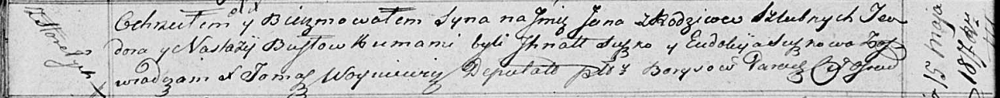

**Бусел Ян Теодоров (Busła Jan)**

15 мая 1817 г -- крещение (НИАБ 136-13-894, лист 96об, №34/1817-р
(ориг)).

**НИАБ 136-13-894: Метрическая запись №34/1817-р (ориг).**

Осовская Покровская церковь. 15 мая 1817 года. Метрическая запись о
крещении.

Busła Jan -- сын родителей с деревни Горелое.

Busła Teodor -- отец.

Busłowa Nastazija -- мать.

Suszko Jhnat -- кум.

Suszkowa Eudokija -- кума.

Woyniewicz Tomasz -- ксёндз.
