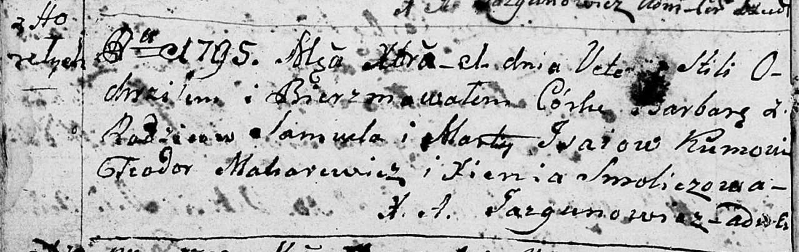

**Исай Самуил (Jsaj Samuel)**

1 декабря 1795 г -- крещение дочери Варвары (НИАБ 136-13-894, лист 26об,
№59/1795-р (ориг)).

**НИАБ 136-13-894:** Лист 26об. **Метрическая запись №59/1795-р
(ориг).**

{width="6.496527777777778in"
height="2.057110673665792in"}

Дедиловичская Покровская церковь. 1 декабря 1795 года. Метрическая
запись о крещении.

Jsaiowna Barbara -- дочь родителей с деревни Горелое.

Jsay Samuel -- отец.

Jsaiowa Marta -- мать.

Makarewicz Teodor - кум.

Smoliczowa Xienia - кума.

Jazgunowicz Antoni -- ксёндз.
