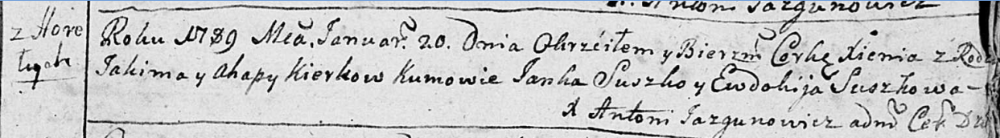

**Керко Агапа (Kierkowa Ahapa)**

20 января 1789 г -- крещение дочери Ксени (НИАБ 136-13-894, лист 6,
№3/1789-р (ориг)), (РГИА 823-2-18, лист 237об, №2/1789-р (коп)).

**НИАБ 136-13-894:** Лист 6. **Метрическая запись №3/1789-р (ориг).**

Дедиловичская Покровская церковь. 20 января 1789 года. Метрическая
запись о крещении.

Kierkowna Xienia -- дочь родителей с деревни Горелое.

Kierko Jakim -- отец.

Kierkowa Ahapa -- мать.

Suszko Janka - кум.

Suszkowa Ewdokija - кума.

Jazgunowicz Antoni -- ксёндз.

**РГИА 823-2-18:** Лист 237об. **Метрическая запись №2/1789-р (коп).**

Дедиловичская Покровская церковь. 20 января 1789 года. Метрическая
запись о крещении.

Kierkowna Xienia -- дочь родителей с деревни Горелое.

Kierko Jakim -- отец.

Kierkowa Ahapa -- мать.

Suszko Jan -- кум.

Suszkowa Eudokia - кума.

Jazgunowicz Antoni -- ксёндз.
