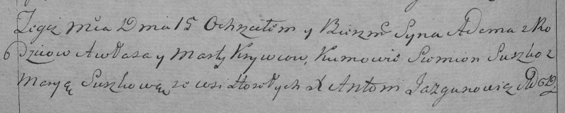

**Кривец Марта (Krywcowa Marta)**

15 октября 1794 г -- крещение сына Адама (НИАБ 136-13-894, лист 23,
№44/1794-р (ориг)), (РГИА 823-2-18, лист 250об, №31/1794-р (коп)).

**НИАБ 136-13-894:** Лист 23. **Метрическая запись №44/1794-р (ориг).**

Дедиловичская Покровская церковь. 15 октября 1794 года. Метрическая
запись о крещении.

Krywec Adam -- сын родителей с деревни Горелое.

Krywec Awłas -- отец.

Krywcowa Marta -- мать.

Suszko Siemion - кум.

Suszkowa Maryia - кума.

Jazgunowicz Antoni -- ксёндз.

**РГИА 823-2-18:** Лист 250об. **Метрическая запись №31/1794-р (коп).**

Дедиловичская Покровская церковь. 15 октября 1794 года. Метрическая
запись о крещении.

Krywiec Adam -- сын родителей с деревни Горелое.

Krywiec Awłas -- отец.

Krywcowa Marta -- мать.

Suszko Siemion -- кум.

Suszkowa Marya -- кума.

Jazgunowicz Antoni -- ксёндз.
