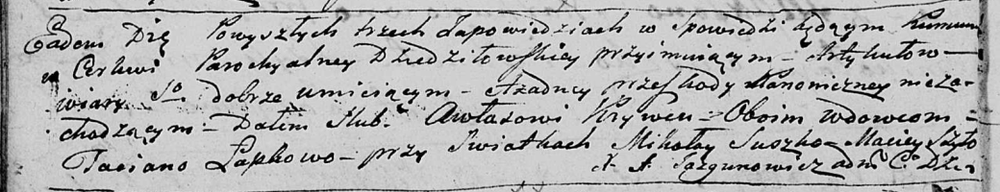

**Кривец Авлас (Krywiec Awłas)**

20 января 1796 г -- венчание с вдовой Татьяной Лапковой (НИАБ
136-13-920, лист 2об, №2/1796-б (ориг)).

**НИАБ 136-13-894:** Лист 2об. **Метрическая запись №2/1796-б (ориг).**

Дедиловичская Покровская церковь. 20 января 1796 года. Метрическая
запись о венчании.

Krywiec Awłas -- жених, вдовец, с деревни \[Горелое\].

Łapkowa Taciana -- невеста, вдова.

Suszko Mikołay -- свидетель.

Szyło Maciey -- свидетель.

Jazgunowicz Antoni -- ксёндз.
