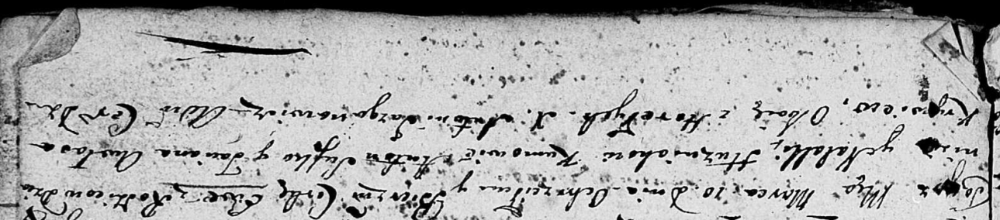

**Кривец (в 1м браке Лапкова) Татьяна (Krywcowa (Łapkowa) Taciana
Awłasa)**

20 января 1796 г -- венчание с вдовцом Авласом Крывцом(НИАБ 136-13-920,
лист 2об, №2/1796-б (ориг)).

12 марта 1805 г -- крестная мать Стефана Павла, сына Гузняков Дзяниса и
Натальи с деревни Отруб (НИАБ 136-13-894, лист 57, №19/1805-р (ориг)).

10 марта 1807 г -- крестная мать Евы, дочери Гузняков Дзяниса и Натальи
с деревни Клинники (НИАБ 136-13-894, лист 62, №16/1807-р (ориг)).

**НИАБ 136-13-894:** Лист 2об. **Метрическая запись №2/1796-б (ориг).**

{width="6.496527777777778in"
height="1.2491513560804899in"}

Дедиловичская Покровская церковь. 20 января 1796 года. Метрическая
запись о венчании.

Krywiec Awłas -- жених, вдовец, с деревни \[Горелое\].

Łapkowa Taciana -- невеста, вдова.

Suszko Mikołay -- свидетель.

Szyło Maciey -- свидетель.

Jazgunowicz Antoni -- ксёндз.

**НИАБ 136-13-894:** Лист 57. **Метрическая запись №19/1805-р (ориг).**

{width="6.496527777777778in"
height="1.5388101487314085in"}

Дедиловичская Покровская церковь. 12 марта 1805 года. Метрическая запись
о крещении.

\[Huzniak\] Stefan Paweł -- сын родителей с деревни Отруб.

\[Huzniak\] Dzianis -- отец.

\[Huzniakowa\] Natalja -- мать.

Suszko Anton -- кум, с деревни Горелое.

Krywcowa Taciana -- кума, с деревни Горелое.

Jazgunowicz Antoni -- ксёндз.

**НИАБ 136-13-894:** Лист 62. **Метрическая запись №16/1807-р (ориг).**

{width="6.496527777777778in"
height="1.431528871391076in"}

Дедиловичская Покровская церковь. 10 марта 1807 года. Метрическая запись
о крещении.

Huzniakowna Ewa -- дочь родителей с деревни \[Клинники, Отруб\].

Huzniak Dzianis -- отец.

Huzniakowa Natalla -- мать.

Suszko Anton -- кум, с деревни Горелое.

Krywcowa Awłasa Taciana -- кума, с деревни Горелое.

Jazgunowicz Antoni -- ксёндз.
