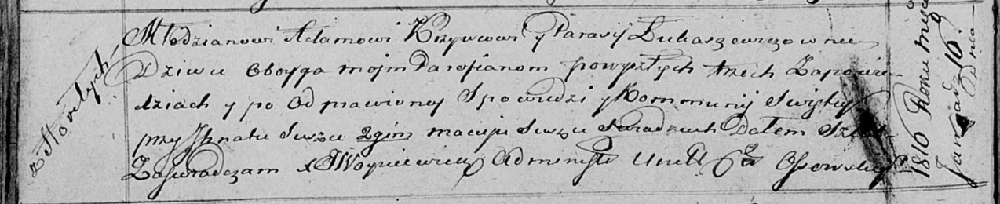

**Кривец Адам (Krywiec, Krzywiec Adam)**

16 января 1816 г -- венчание с девкой Парасей Лукашевич (НИАБ
136-13-920, лист 22об, №2/1816-б (ориг)).

1 февраля 1820 г -- крещение сына Базылия (НИАБ 136-13-894, лист 103об,
№3/1820-р (ориг)).

16 октября 1821 г -- крещение сына Лукаша (НИАБ 136-13-894, лист 107об,
№48/1821-р (ориг)).

**НИАБ 136-13-920:** Лист 22об. **Метрическая запись №2/1816-б (ориг).**

Осовская Покровская церковь. 16 января 1816 года. Запись о венчании.

Krzywec Adam -- жених, молодой, парафии Осовской, с деревни Горелое.

Łukaszewiczowna Parasia -- невеста, девка, парафии Осовской.

Suszko Jhnat -- свидетель.

Suszko Maciey -- свидетель.

Woyniewicz Tomasz -- ксёндз.

**НИАБ 136-13-894:** Лист 103об. **Метрическая запись №3/1820-р
(ориг).**

Осовская Покровская церковь. 1 февраля 1820 года. Метрическая запись о
крещении.

Krywieć Bazyli -- сын родителей с деревни Горелое.

Krywieć Adam -- отец.

Krywcowa Parasia -- мать.

Suszko Stefan -- кум.

Suszkowa Hrypina -- кума.

Woyniewicz Tomasz -- ксёндз.

**НИАБ 136-13-894:** Лист 107об. **Метрическая запись №48/1821-р
(ориг).**

Осовская Покровская церковь. 16 октября 1821 года. Метрическая запись о
крещении.

Krywiec Łukasz -- дочь родителей с деревни Горелое.

Krywiec Adam -- отец.

Krywcowa Parasia -- мать.

Suszko Stefan -- кум.

Ostrowska Hrypina -- кума.

Woyniewicz Tomasz -- ксёндз.
