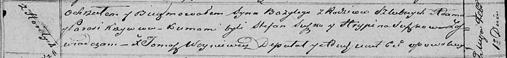

**Кривец Базылий Адамов (Krywiec Bazyli)**

1 февраля 1820 г -- крещение (НИАБ 136-13-894, лист 103об, №3/1820-р
(ориг)).

**НИАБ 136-13-894:** Лист 103об. **Метрическая запись №3/1820-р
(ориг).**

Осовская Покровская церковь. 1 февраля 1820 года. Метрическая запись о
крещении.

Krywieć Bazyli -- сын родителей с деревни Горелое.

Krywieć Adam -- отец.

Krywcowa Parasia -- мать.

Suszko Stefan -- кум.

Suszkowa Hrypina -- кума.

Woyniewicz Tomasz -- ксёндз.
