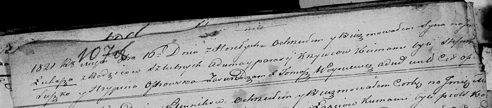

**Кривец Лукаш Адамов (Krywiec Łukasz)**

16 октября 1821 г -- крещение (НИАБ 136-13-894, лист 107об, №48/1821-р
(ориг)).

**НИАБ 136-13-894:** Лист 107об. **Метрическая запись №48/1821-р
(ориг).**

Осовская Покровская церковь. 16 октября 1821 года. Метрическая запись о
крещении.

Krywiec Łukasz -- дочь родителей с деревни Горелое.

Krywiec Adam -- отец.

Krywcowa Parasia -- мать.

Suszko Stefan -- кум.

Ostrowska Hrypina -- кума.

Woyniewicz Tomasz -- ксёндз.
