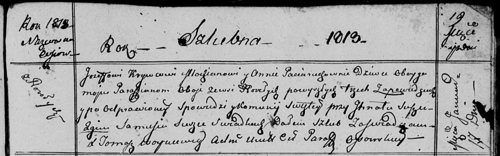
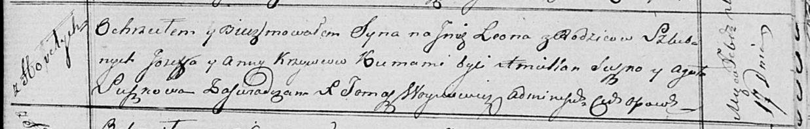
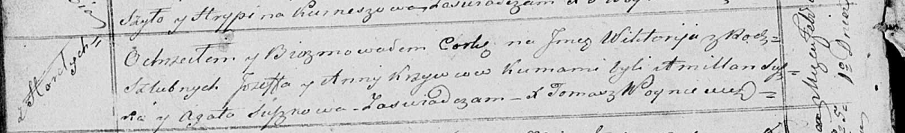

**Кривец (в девичестве Потеруха) Анна (Krywcowa Anna z Paciaruchow)**

17 января 1813 г -- венчание с молодым Иосифом Кривцом с деревни Горелое
(НИАБ 136-13-920, лист 19, №1/1813-б (ориг)).

1 ноября 1814 г -- крещение дочери Ксени (НИАБ 136-13-894, лист 91,
№62/1814-р (ориг)).

17 февраля 1818 г -- крещение сына Леона (НИАБ 136-13-894, лист 98,
№5/1818-р (ориг)).

1 февраля 1821 г -- крещение дочери Виктории (НИАБ 136-13-894, лист
105об, №5/1821-р (ориг)).

**НИАБ 136-13-920:** Лист 19. **Метрическая запись №1/1813-б (ориг).**

Осовская Покровская я церковь. 17 января 1813 года. Запись о венчании.

Krywiec Jozef -- жених, молодой, парафии Осовской, с деревни Горелое.

Paciaruchowna Anna -- невеста, девка, парафии Осовской, с деревни
Горелое.

Suszko Jhnat -- свидетель.

Suszko Samuś -- свидетель.

Woyniewicz Tomasz -- ксёндз.

**НИАБ 136-13-894:** Лист 91. **Метрическая запись №62/1814-р (ориг).**

Осовская Покровская церковь. 1 ноября 1814 года. Метрическая запись о
крещении.

Krywcowna Xienia -- дочь родителей с деревни Горелое.

Kryweć Jozef -- отец.

Krywcowa Anna -- мать.

Suszko Anton -- кум.

Suszkowa Parasia -- кума.

Woyniewicz Tomasz -- ксёндз.

**НИАБ 136-13-894:** Лист 98. **Метрическая запись №5/1818-р (ориг).**

Осовская Покровская церковь. 17 февраля 1818 года. Метрическая запись о
крещении.

Krywieć Leon -- сын родителей с деревни Горелое.

Krywieć Jozef -- отец.

Krywcowa Anna -- мать.

Suszko Amilian -- кум.

Suszkowa Agata -- кума.

Woyniewicz Tomasz -- ксёндз.

**НИАБ 136-13-894:** Лист 105об. **Метрическая запись №5/1821-р
(ориг).**

Осовская Покровская церковь. 1 февраля 1821 года. Метрическая запись о
крещении.

Krywcowna Wiktorija -- дочь родителей с деревни Горелое.

Krywec Jozef -- отец.

Krywcowa Anna -- мать.

Suszko Amillan -- кум.

Suszkowa Agata -- кума.

Woyniewicz Tomasz -- ксёндз.
