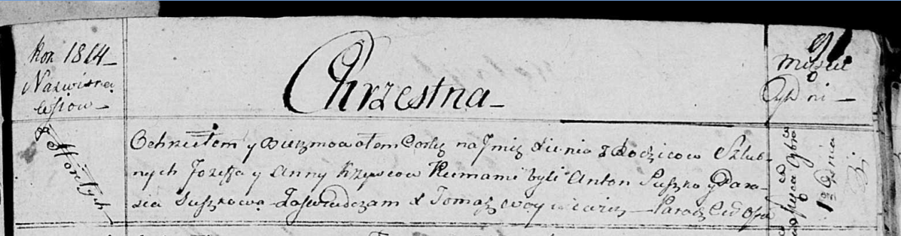

**Кривец Ксеня Иосифова (Krywcowna Xienia)**

1 ноября 1814 г -- крещение (НИАБ 136-13-894, лист 91, №62/1814-р
(ориг)).

**НИАБ 136-13-894:** Лист 91. **Метрическая запись №62/1814-р (ориг).**

Осовская Покровская церковь. 1 ноября 1814 года. Метрическая запись о
крещении.

Krywcowna Xienia -- дочь родителей с деревни Горелое.

Kryweć Jozef -- отец.

Krywcowa Anna -- мать.

Suszko Anton -- кум.

Suszkowa Parasia -- кума.

Woyniewicz Tomasz -- ксёндз.
