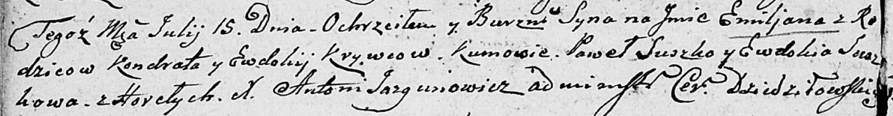

**Кривец Емильян Кондратов (Krywiec Emiljan)**

15 июля 1806 г -- крещение (НИАБ 136-13-894, лист 60об, №32/1806-р
(ориг)).

**НИАБ 136-13-894:** Лист 60об. **Метрическая запись №32/1806-р
(ориг).**

Дедиловичская Покровская церковь. 15 июля 1806 года. Метрическая запись
о крещении.

Kryweć Emiljan -- сын родителей с деревни Горелое.

Kryweć Kondrat -- отец.

Krywcowa Ewdokija -- мать.

Suszko Paweł -- кум.

Suszkowa Ewdokia -- кума.

Jazgunowicz Antoni -- ксёндз.
