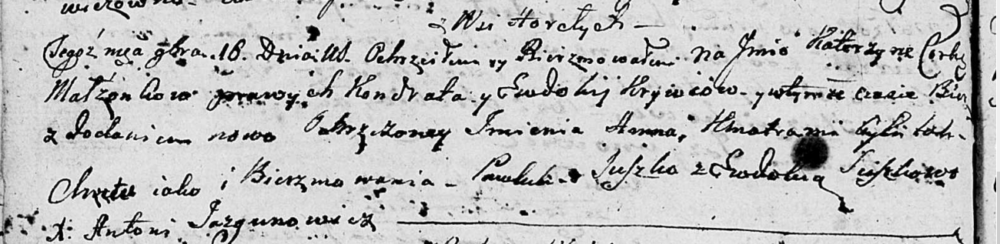

**Кривец Катерына Кондратова (Krywcowna Katerzyna)**

16 ноября 1802 г -- крещение (НИАБ 136-13-894, лист 48об, №42/1802-р
(ориг)).

**НИАБ 136-13-894:** Лист 48об. **Метрическая запись №42/1802-р
(ориг).**

Дедиловичская Покровская церковь. 16 ноября 1802 года. Метрическая
запись о крещении.

Krywcowna Katerzyna Anna -- дочь родителей с деревни Горелое.

Krywiec Kondrat -- отец.

Krywcowa Ewdokija -- мать.

Suszko Pawluk -- кум.

Suszkowa Ewdokija -- кума.

Jazgunowicz Antoni -- ксёндз.
