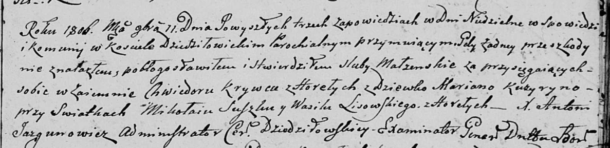
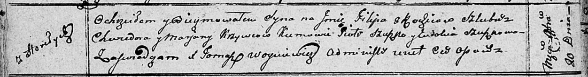

**Кривец (Кузуро) Марьяна (Krywcowa (Kuzyryna) Marjana)**

11 ноября 1806 г -- венчание с Хведором Крывцом с деревни Горелое (НИАБ
136-13-920, лист 12, №3/1806-б (ориг)).

20 ноября 1810 г -- крещение сына Филипа (НИАБ 136-13-894, лист 79об,
№59/1810-р (ориг)).

**НИАБ 136-13-920:** Лист 12. **Метрическая запись №3/1806-б (ориг).**

Дедиловичская Покровская церковь. 11 ноября 1806 года. Метрическая
запись о венчании.

Krywiec Chwiedor -- жених, с деревни Горелое.

Kuzyryna Marjana -- невеста, девка.

Suszko Mikołay -- свидетель.

Lisowski Wasil -- свидетель, с деревни Горелое.

Jazgunowicz Antoni -- ксёндз.

**НИАБ 136-13-894:** Лист 79об. **Метрическая запись №59/1810-р
(ориг).**

Осовская Покровская церковь. 20 ноября 1810 года. Метрическая запись о
крещении.

Kryweć Filip -- сын родителей с деревни Горелое.

Krywieć Chwiedor -- отец.

Krywcowa Marjana -- мать.

Szuszko Piotr -- кум.

Szuszkowa Eudokia -- кума.

Woyniewicz Tomasz -- ксёндз.
