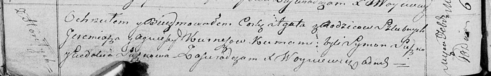

**Курнеш Агата Еремиева (Kurneszowna Agata)**

10 февраля 1818 г -- крещение (НИАБ 136-13-894, лист 97об, №2/1818-р
(ориг)).

**НИАБ 136-13-894:** Лист 97об. **Метрическая запись №2/1818-р (ориг).**

Осовская Покровская церковь. 10 февраля 1818 года. Метрическая запись о
крещении.

Kurneszowna Agata -- дочь родителей с деревни Горелое.

Kurniesz Jeremiasz -- отец.

Kurnieszowa Agnieszka -- мать.

Suszko Symon -- кум.

Suszkowa Eudokia -- кума.

Woyniewicz Tomasz -- ксёндз.
