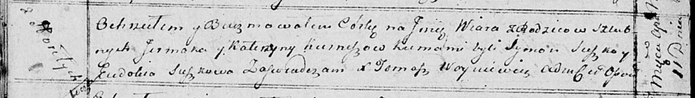

**Курнеш Вяра Ермакова (Kurneszowna Wiara)**

11 апреля 1815 г -- крещение (НИАБ 136-13-894, лист 92об, №24/1815-р
(ориг)).

**НИАБ 136-13-894:** Лист 92об. **Метрическая запись №24/1815-р
(ориг).**

Осовская Покровская церковь. 11 апреля 1815 года. Метрическая запись о
крещении.

Kurneszowna Wiara -- дочь родителей с деревни Горелое.

Kurnesz Jermak -- отец.

Kurneszowa Katerzyna -- мать.

Suszko Symon -- кум.

Suszkowa Ewdokia -- кума.

Woyniewicz Tomasz -- ксёндз.
