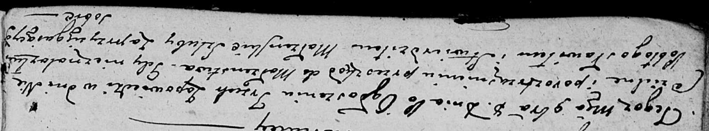
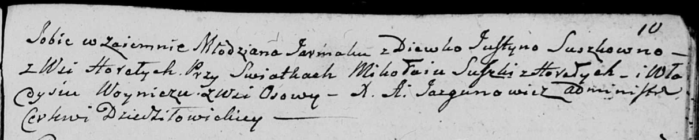
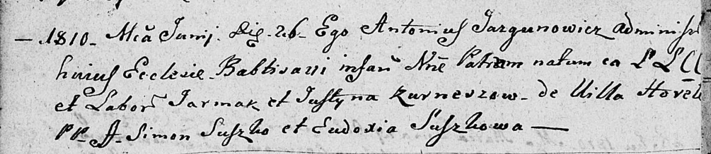
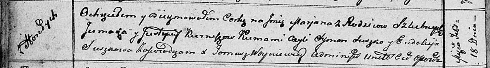

**Курнеш Ермак, Еремия (Kurnesz Jarmak, Jermak, Jeremiasz)**

8 ноября 1803 г -- венчание с девкой Юстыной Сушко с деревни Горелое
(НИАБ 136-13-920, лист 9об-10, №11/1803-б (ориг)).

26 июня 1810 г -- крещение сына Петра? (НИАБ 136-13-894, лист 77об,
№23/1810-р (ориг)).

18 февраля 1812 г -- крещение дочери Марьяны (НИАБ 136-13-894, лист
83об, №12/1812-р (ориг)).

2 октября 1820 г -- крещение сына Яна (НИАБ 136-13-894, лист 104об,
№31/1820-р (ориг)).

**НИАБ 136-13-920:** Лист 9об-10. **Метрическая запись №11/1803-б
(ориг).**

Дедиловичская Покровская церковь. 8 ноября 1803 года. Метрическая запись
о венчании.

\[Kurnesz\] Jarmak -- жених, молодой, с деревни \[Горелое\].

Suszkowna Justyna -- невеста, девка, с деревни Горелое.

Suszko Mikołay -- свидетель, с деревни Горелое.

Woynicz Władyś -- свидетель, с деревни Осовo.

Jazgunowicz Antoni -- ксёндз.

**НИАБ 136-13-894:** Лист 77об. **Метрическая запись №23/1810-р
(ориг).**

Дедиловичская Покровская церковь. 26 июня 1810 года. Метрическая запись
о крещении.

Kurnesz Piotr? -- сын родителей из деревни Горелое.

Kurnesz Jarmak -- отец, крестьянин.

Kurneszowa Justyna -- мать, крестьянка.

Suszko Simon -- кум.

Suszkowa Eudoxia -- кума.

Jazgunowicz Antoni -- ксёндз. (лат. язык)

**НИАБ 136-13-894:** Лист 83об. **Метрическая запись №12/1812-р
(ориг).**

Осовская Покровская церковь. 18 февраля 1812 года. Метрическая запись о
крещении.

Kurneszowna Marjana -- дочь родителей с деревни Горелое.

Kurnesz Jermak -- отец.

Kurneszowa Justyna -- мать.

Suszko Symon -- кум.

Suszkowa Eudokija -- кума.

Woyniewicz Tomasz -- ксёндз.

**НИАБ 136-13-894:** Лист 104об. **Метрическая запись №31/1820-р
(ориг).**

Осовская Покровская церковь. 2 октября 1820 года. Метрическая запись о
крещении.

Kurnesz Jan -- сын родителей с деревни Горелое.

Kurnesz Jeremiasz -- отец.

Kurnieszowa Justyna -- мать.

Suszko Symon -- кум.

Suszkowa Eudokija -- кума.

Woyniewicz Tomasz -- ксёндз.
