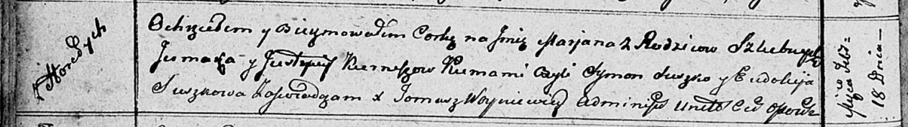

**Курнеш Марьяна Ермакова (Kurneszowna Marjana)**

18 февраля 1812 г -- крещение (НИАБ 136-13-894, лист 83об, №12/1812-р
(ориг)).

**НИАБ 136-13-894:** Лист 83об. **Метрическая запись №12/1812-р
(ориг).**

{width="6.496527777777778in"
height="0.9159109798775154in"}

Осовская Покровская церковь. 18 февраля 1812 года. Метрическая запись о
крещении.

Kurneszowna Marjana -- дочь родителей с деревни Горелое.

Kurnesz Jermak -- отец.

Kurneszowa Justyna -- мать.

Suszko Symon -- кум.

Suszkowa Eudokija -- кума.

Woyniewicz Tomasz -- ксёндз.
