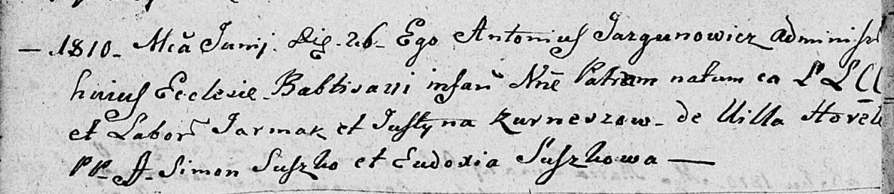

**Курнеш Пётр? Ермаков (Kurnesz Piotr?)**

26 июня 1810 г -- крещение (НИАБ 136-13-894, лист 77об, №23/1810-р
(ориг)).

**НИАБ 136-13-894:** Лист 77об. **Метрическая запись №23/1810-р
(ориг).**

Дедиловичская Покровская церковь. 26 июня 1810 года. Метрическая запись
о крещении.

Kurnesz Piotr? -- сын родителей из деревни Горелое.

Kurnesz Jarmak -- отец, крестьянин.

Kurneszowa Justyna -- мать, крестьянка.

Suszko Simon -- кум.

Suszkowa Eudoxia -- кума.

Jazgunowicz Antoni -- ксёндз. (лат. язык)
