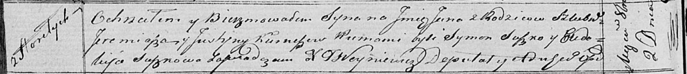

**Курнеш Ян Ермаков (Kurnesz Jan)**

2 октября 1820 г -- крещение (НИАБ 136-13-894, лист 104об, №31/1820-р
(ориг)).

**НИАБ 136-13-894:** Лист 104об. **Метрическая запись №31/1820-р
(ориг).**

{width="6.496527777777778in"
height="0.7093952318460193in"}

Осовская Покровская церковь. 2 октября 1820 года. Метрическая запись о
крещении.

Kurnesz Jan -- сын родителей с деревни Горелое.

Kurnesz Jeremiasz -- отец.

Kurnieszowa Justyna -- мать.

Suszko Symon -- кум.

Suszkowa Eudokija -- кума.

Woyniewicz Tomasz -- ксёндз.
