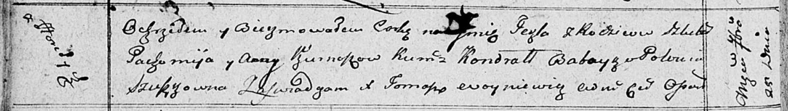

**Курнеш Текля Пахомьева (Kurneszowna Tekla)**

25 сентября 1810 г -- крещение (НИАБ 136-13-894, лист 78об, №42/1810-р
(ориг)).

**НИАБ 136-13-894:** Лист 78об. **Метрическая запись №42/1810-р
(ориг).**

{width="6.496527777777778in"
height="0.9219455380577428in"}

Осовская Покровская церковь. 25 сентября 1810 года. Метрическая запись о
крещении.

Kurneszowna Tekla -- дочь родителей с деревни Горелое.

Kurnesz Pachomij -- отец.

Kurneszowa Anna -- мать.

Babouka Kondrat -- кум.

Szuszkowna Połonia -- кума.

Woyniewicz Tomasz -- ксёндз.
