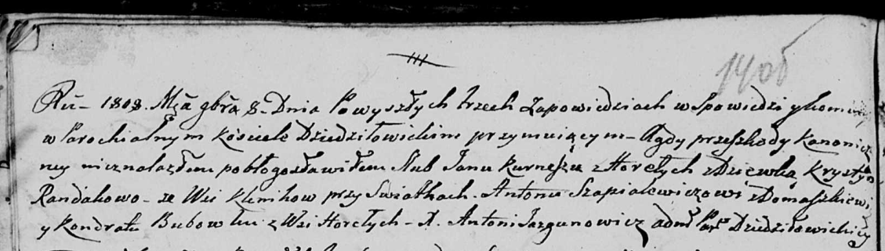

**Курнеш Пётр Янов (Kurnesz Piotr)**

30 июня 1812 г -- крещение (НИАБ 136-13-894, лист 84об, №33/1812-р
(ориг)).

**НИАБ 136-13-894:** Лист 84об. **Метрическая запись №33/1812-р
(ориг).**

{width="6.496527777777778in"
height="0.8334383202099738in"}

Осовская Покровская церковь. 30 июня 1812 года. Метрическая запись о
крещении.

Kurnesz Piotr -- сын родителей с деревни Горелое.

Kurnesz Jan -- отец.

Kurneszowa Krystyna -- мать.

Suszko Jan -- кум.

Krywcowa Anna -- кума.

Woyniewicz Tomasz -- ксёндз.
