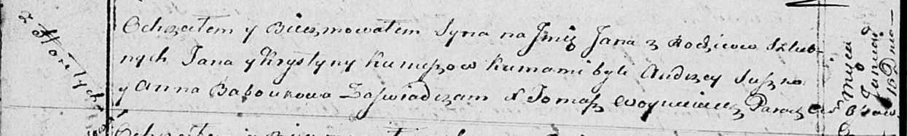

**Курнеш Ян Янов (Kurnesz Jan)**

16 января 1814 г -- крещение (НИАБ 136-13-894, лист 91об, №4/1815-р
(ориг)).

**НИАБ 136-13-894:** Лист 91об. **Метрическая запись №4/1815-р (ориг).**

Осовская Покровская церковь. 16 января 1815 года. Метрическая запись о
крещении.

Kurnesz Jan -- сын родителей с деревни Горелое.

Kurnesz Jan -- отец.

Kurneszowa Krystyna -- мать.

Suszko Audzey -- кум.

Baboukowa Anna -- кума.

Woyniewicz Tomasz -- ксёндз.
