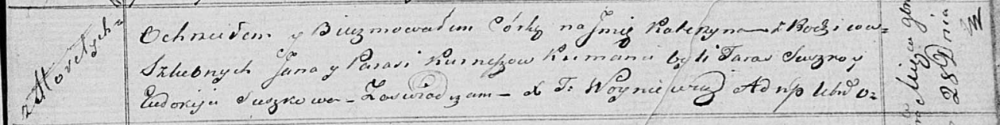

**Курнеш Катерына Янова (Kurneszowna Katerzyna)**

28 ноября 1820 г -- крещение (НИАБ 136-13-894, лист 105, №43/1820-р
(ориг)).

**НИАБ 136-13-894:** Лист 105. **Метрическая запись №43/1820-р (ориг).**

Осовская Покровская церковь. 28 ноября 1820 года. Метрическая запись о
крещении.

Kurneszowna Katerzyna -- дочь родителей с деревни Горелое.

Kurniesz Jan -- отец.

Kurneszowa Parasia -- мать.

Suszko Taras -- кум.

Suszkowa Eudokija -- кума.

Woyniewicz Tomasz -- ксёндз.
