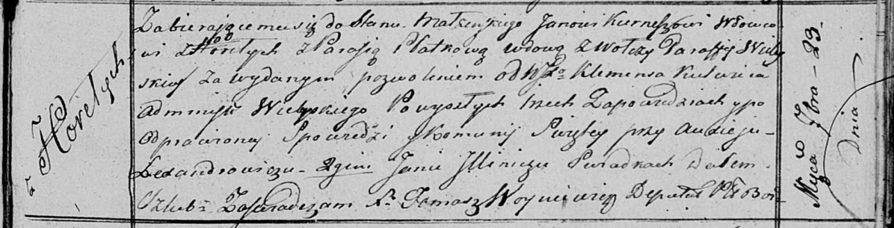
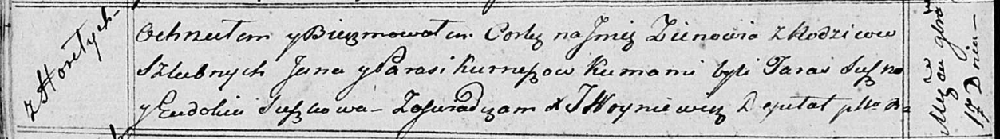

**Курнеш Ян (Kurnesz Jan)**

23 сентября 1817 г -- венчание с вдовой Парасей Плотко с деревни Волча
(НИАБ 136-13-920, лист 24, №5/1817-б (ориг)).

17 ноября 1818 г -- крещение дочери Зеновии (НИАБ 136-13-894, лист 99об,
№40/1818-р (ориг)).

28 ноября 1820 г -- крещение дочери Катерыны (НИАБ 136-13-894, лист 105,
№43/1820-р (ориг)).

**НИАБ 136-13-920:** Лист 24. **Метрическая запись №5/1817-б (ориг).**

Осовская Покровская церковь. 23 сентября 1817 года. Запись о венчании.

Kurnesz Jan -- жених, вдовец, парафии Осовской, с деревни Горелое.

Płоtkowa Parasia -- невеста, вдова, парафии Вилейской, с деревни Волчи.

Kulwic Klemens, WJP -- разрешил брак, администратор Вилейский.

Lexandrowicz Audiey -- свидетель.

Jllinicz Jan -- свидетель.

Woyniewicz Tomasz -- ксёндз.

**НИАБ 136-13-894:** Лист 99об. **Метрическая запись №40/1818-р
(ориг).**

Осовская Покровская церковь. 17 ноября 1818 года. Метрическая запись о
крещении.

Kurnieszowna Zienowia -- дочь родителей с деревни Горелое.

Kurniesz Jan -- отец.

Kurnieszowa Parasia -- мать.

Suszko Taras -- кум.

Suskowa Eudokia -- кума.

Woyniewicz Tomasz -- ксёндз.

**НИАБ 136-13-894:** Лист 105. **Метрическая запись №43/1820-р (ориг).**

Осовская Покровская церковь. 28 ноября 1820 года. Метрическая запись о
крещении.

Kurneszowna Katerzyna -- дочь родителей с деревни Горелое.

Kurniesz Jan -- отец.

Kurneszowa Parasia -- мать.

Suszko Taras -- кум.

Suszkowa Eudokija -- кума.

Woyniewicz Tomasz -- ксёндз.
