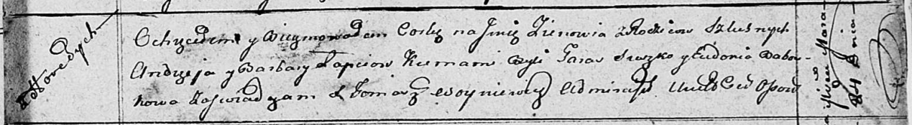
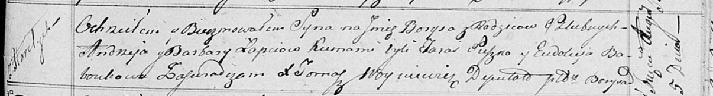

**Лапец Андрей (Lapać, Łapiec Andrzey)**

24 марта 1812 г -- крещение дочери Зеновии (НИАБ 136-13-894, лист 84,
№20/1812-р (ориг)).

30 марта 1814 г -- крещение сына Владыслава (НИАБ 136-13-894, лист 89,
№19/1814-р (ориг)).

5 августа 1817 г -- крещение сына Барыса (НИАБ 136-13-894, лист 97,
№49/1817-р (ориг)).

19 января 1819 г -- крещение дочери Марцели (НИАБ 136-13-894, лист 100,
№4/1819-р (ориг)).

**НИАБ 136-13-894:** Лист 84. **Метрическая запись №20/1812-р (ориг).**

Осовская Покровская церковь. 24 марта 1812 года. Метрическая запись о
крещении.

Lapciowna Zienowija -- дочь родителей с деревни Горелое.

Lapać Andrzey -- отец.

Lapciowa Barbara -- мать.

Suszko Taras -- кум.

Baboukowa Eudokia -- кума.

Woyniewicz Tomasz -- ксёндз.

**НИАБ 136-13-894:** Лист 89. **Метрическая запись №19/1814-р (ориг).**

Осовская Покровская церковь. 30 марта 1814 года. Метрическая запись о
крещении.

Łapieć Władysław -- сын родителей с деревни Горелое.

Łapieć Andrzey -- отец.

Łapciowa Barbara -- мать.

Suszko Taras -- кум.

Baboukowa Eudokija -- кума.

Woyniewicz Tomasz -- ксёндз.

**НИАБ 136-13-894:** Лист 97. **Метрическая запись №49/1817-р (ориг).**

Осовская Покровская церковь. 5 августа 1817 года. Метрическая запись о
крещении.

Łapieć Barys -- сын родителей с деревни Горелое.

Łapieć Andrzey -- отец.

Łapciowa Barbara -- мать.

Suzko Taras -- кум.

Baboukowa Eudokija -- кума.

Woyniewicz Tomasz -- ксёндз.

**НИАБ 136-13-894:** Лист 100. **Метрическая запись №4/1819-р (ориг).**

Осовская Покровская церковь. 19 января 1819 года. Метрическая запись о
крещении.

Łapciowna Marcela -- дочь родителей с деревни Горелое.

Łapiec Andrzey -- отец.

Łapciowa Barbara -- мать.

Suszko Taras -- кум.

Baboukowa Eudokija -- кума.

Woyniewicz Tomasz -- ксёндз.
