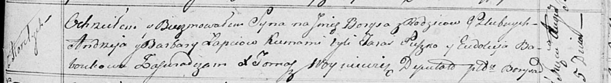

**Лапец Барыс Андреев (Łapiec Barys)**

5 августа 1817 г -- крещение (НИАБ 136-13-894, лист 97, №49/1817-р
(ориг)).

**НИАБ 136-13-894:** Лист 97. **Метрическая запись №49/1817-р (ориг).**

Осовская Покровская церковь. 5 августа 1817 года. Метрическая запись о
крещении.

Łapieć Barys -- сын родителей с деревни Горелое.

Łapieć Andrzey -- отец.

Łapciowa Barbara -- мать.

Suzko Taras -- кум.

Baboukowa Eudokija -- кума.

Woyniewicz Tomasz -- ксёндз.
