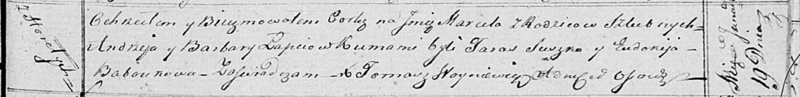

**Лапец Марцеля Андреева (Lapciowna Marcela)**

19 января 1819 г -- крещение (НИАБ 136-13-894, лист 100, №4/1819-р
(ориг)).

**НИАБ 136-13-894:** Лист 100. **Метрическая запись №4/1819-р (ориг).**

Осовская Покровская церковь. 19 января 1819 года. Метрическая запись о
крещении.

Łapciowna Marcela -- дочь родителей с деревни Горелое.

Łapiec Andrzey -- отец.

Łapciowa Barbara -- мать.

Suszko Taras -- кум.

Baboukowa Eudokija -- кума.

Woyniewicz Tomasz -- ксёндз.
