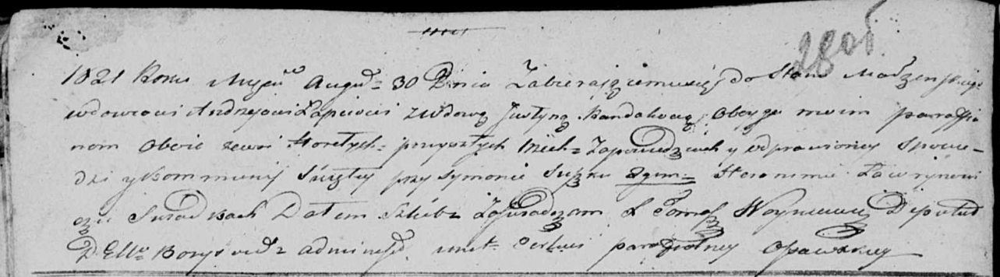

**Лапец Андрей (Lapać Andrzey)**

30 августа 1821 г -- венчание с вдовой Юстыной Рандак с деревни Горелое
(НИАБ 136-13-920, лист 28об, №7/1821-б (ориг)).

**НИАБ 136-13-920:** Лист 28об. **Метрическая запись №7/1821-б (ориг).**

Осовская Покровская церковь. 30 августа 1821 года. Запись о венчании.

Łapac Andrzey -- жених, вдовец, парафии Осовской, с деревни Горелое.

Randakowa Justyna -- невеста, вдова, парафии Осовской, с деревни
Горелое.

Suszko Symon -- свидетель.

Ławrynowicz Heronim -- свидетель.

Woyniewicz Tomasz -- ксёндз.
