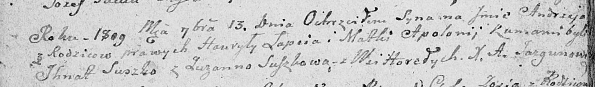

**Лапец Андрей Гаврылов (Lapiec Andrzey)**

13 сентября 1809 г -- крещение (НИАБ 136-13-894, лист 75об, №45/1809-р
(ориг)).

**НИАБ 136-13-894:** Лист 75об. **Метрическая запись №45/1809-р
(ориг).** (см. тж. №52/1809-р (ориг))

Дедиловичская Покровская церковь. 13 сентября 1809 года. Метрическая
запись о крещении.

Łapać Andrzey -- сын родителей с деревни Горелое.

Łapać Hauryła -- отец.

Łapciowa Apołonija -- мать.

Suszko Jhnat -- кум.

Suszkowa Zuzanna -- кума.

Jazgunowicz Antoni -- ксёндз.
