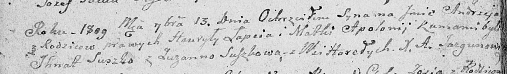

**Лапец Гаврыла (Lapiec Hauryła, Gabriel)**

10 сентября 1800 г -- венчание с девкой Палюхой Бусло с деревни Горелое
(НИАБ 136-13-920, лист 7, №6/1800-б (ориг), НИАБ 136-13-949, лист 107об,
№6/1800-б (коп)).

13 сентября 1809 г -- крещение сына Андрея (НИАБ 136-13-894, лист 75об,
№45/1809-р (ориг)).

16 ноября 1811 г -- отпевание, умер в возрасте 45 лет (родился около
1766 г) (НИАБ 136-13-919, лист 23, №20/1811-у (ориг)).

**НИАБ 136-13-920:** Лист 7. **Метрическая запись №6/1800-б (ориг).**

{width="6.496527777777778in"
height="1.723869203849519in"}

Дедиловичская Покровская церковь. 10 сентября 1800 года. Метрическая
запись о венчании.

Łapac Gabriel -- жених, с деревни Клинники.

Busłowa Palucha -- невеста, девка с деревни Горелое.

Suszko Chwiedor -- свидетель.

Harauczyk Marko -- свидетель.

Jazgunowicz Antoni -- ксёндз.

**НИАБ 136-13-949:** Лист 107об. **Метрическая запись №6/1800-б (коп).**

(См. тж.: НИАБ 136-13-920, лист 7, №6/1800-б (ориг))

{width="6.496527777777778in"
height="2.0395833333333333in"}

Дедиловичская Покровская церковь. 4 ноября 1800 года. Метрическая запись
о венчании.

Łapiec Gabriel -- жених, молодой, с деревни Горелое \[Клинники\].

Busłowa Palucha -- невеста, девка, с деревни Горелое.

Suszko Chwiedor -- свидетель, с деревни Разлитье.

Harauczyk Marko -- свидетель, с деревни Отруб.

Jazgunowicz Antoni -- ксёндз.

**НИАБ 136-13-894:** Лист 75об. **Метрическая запись №45/1809-р
(ориг).**

(см. тж. №52/1809-р (ориг))

{width="6.496527777777778in"
height="0.9608344269466317in"}

Дедиловичская Покровская церковь. 13 сентября 1809 года. Метрическая
запись о крещении.

Łapać Andrzey -- сын родителей с деревни Горелое.

Łapać Hauryła -- отец.

Łapciowa Apołonija -- мать.

Suszko Jhnat -- кум.

Suszkowa Zuzanna -- кума.

Jazgunowicz Antoni -- ксёндз.

**НИАБ 136-13-919:** Лист 23. **Метрическая запись №20/1811-у (ориг).**

{width="6.496527777777778in"
height="1.1111111111111112in"}

Осовская униатская церковь. 16 ноября 1811 года. Метрическая запись об
отпевании.

Łapec Hauryło -- умерший, 45 лет, с деревни Горелое, похоронен на
кладбище деревни Осово.

Woyniewicz Tomasz -- ксёндз.
