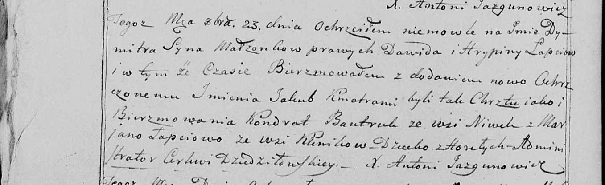

**Лапец Давид (Łapiec Dawid)**

11 января 1797 г -- свидетель венчания Асипа Бусла с деревни Горелое с
девкой Дарьей Скакун с деревни Клинники (НИАБ 136-13-920, лист 4,
№2/1797-б (ориг)).

23 октября 1799 г -- крещение сына Дымитра Якуба (НИАБ 136-13-938, лист
244об, №40/1799-р (коп)).

**НИАБ 136-13-920:** Лист 4. **Метрическая запись №2/1797-б (ориг).**

{width="6.496527777777778in"
height="1.3577734033245845in"}

Дедиловичская Покровская церковь. 11 января 1797 года. Метрическая
запись о венчании.

Busła Asip -- жених, с деревни Горелое.

Skakunowna Daryja -- невеста, девка с деревни Клинники.

Suszko Wasil -- свидетель, с деревни Дедиловичи.

Łapiec Dawid -- свидетель, с деревни Клинники.

Jazgunowicz Antoni -- ксёндз.

**НИАБ 136-13-938:** Лист 244об. **Метрическая запись №40/1799-р
(коп).**

(См. тж. НИАБ 136-13-894, лист 40, №42/1799-р (ориг); РГИА 823-2-18,
лист 272об, №41/1799-р (коп))

{width="6.496527777777778in"
height="1.9916666666666667in"}

Дедиловичская Покровская церковь. 23 октября 1799 года. Метрическая
запись о крещении.

Łapać Dymitr Jakub -- сын родителей с деревни Горелое \[Клинники\].

Łapać Dawid -- отец.

Łapciowa Hrypina -- мать.

Bautruk Kondrat -- кум, с деревни Нивки \[Клинники\].

Łapciowa Marjana - кума, с деревни Клинники.

Jazgunowicz Antoni -- ксёндз.
