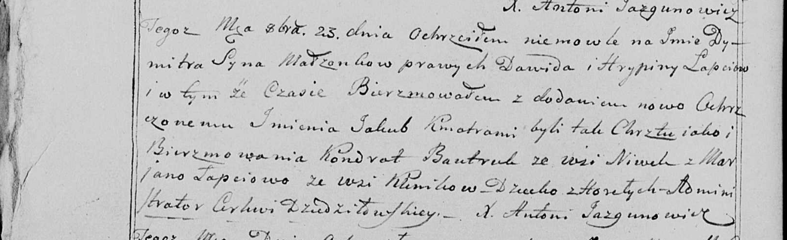

**Лапец Дымитр Давидов (Łapac Dymitr Jakub)**

23 октября 1799 г -- крещение (НИАБ 136-13-938, лист 244об, №40/1799-р
(коп)).

**НИАБ 136-13-938:** Лист 244об. **Метрическая запись №40/1799-р
(коп).**

(См. тж. НИАБ 136-13-894, лист 40, №42/1799-р (ориг); РГИА 823-2-18,
лист 272об, №41/1799-р (коп))

Дедиловичская Покровская церковь. 23 октября 1799 года. Метрическая
запись о крещении.

Łapać Dymitr Jakub -- сын родителей с деревни Горелое \[Клинники\].

Łapać Dawid -- отец.

Łapciowa Hrypina -- мать.

Bautruk Kondrat -- кум, с деревни Нивки \[Клинники\].

Łapciowa Marjana - кума, с деревни Клинники.

Jazgunowicz Antoni -- ксёндз.
