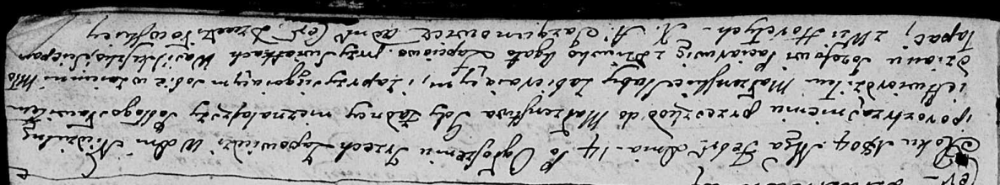

**Лапец Стефан (Łapiec Stefan)**

14 февраля 1804 г -- свидетель венчания молодого Иосифа Потерухи с
деревни Горелое с девкой Агатой Лапец (НИАБ 136-13-920, лист 10,
№3/1804-б (ориг)).

**НИАБ 136-13-920:** Лист 10. **Метрическая запись №3/1804-б (ориг).**

Дедиловичская Покровская церковь. 14 февраля 1804 года. Метрическая
запись о венчании.

Paciarucha Jozef -- жених, молодой с деревни \[Горелое\].

Łapciowa Agata -- невеста, девка.

Suszko Wasil -- свидетель.

Łapac Sciepan -- свидетель, с деревни Горелое.

Jazgunowicz Antoni -- ксёндз.
