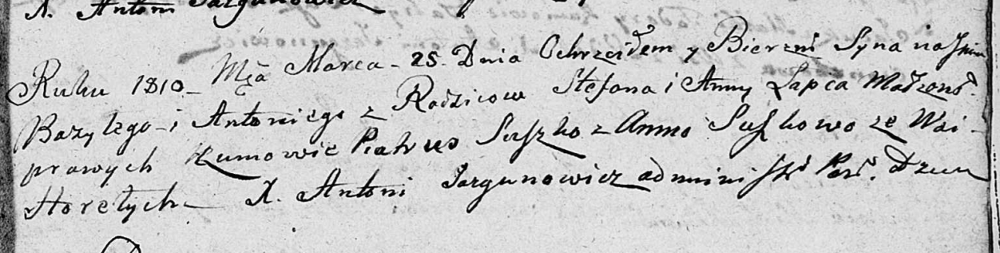

**Лапец Базыль Степанов (Lapiec Bazyl Antoni)**

25 марта 1810 г -- крещение (НИАБ 136-13-894, лист 77, №13/1810-р
(ориг)).

**НИАБ 136-13-894:** Лист 77. **Метрическая запись №13/1810-р (ориг).**

Дедиловичская Покровская церковь. 25 марта 1810 года. Метрическая запись
о крещении.

Łapać Bazyli Antoni -- сын родителей с деревни Горелое.

Łapać Stefan -- отец.

Łapciowa Anna -- мать.

Suszko Piatruś -- кум.

Suszkowa Anna -- кума.

Jazgunowicz Antoni -- ксёндз.
