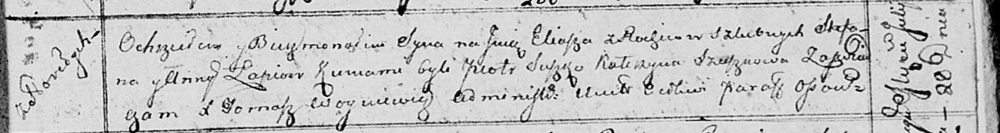

**Лапец Илья Степанов (Lapiec Eliasz)**

22 июля 1813 г -- крещение (НИАБ 136-13-894, лист 87, №21/1813-р
(ориг)).

**НИАБ 136-13-894:** Лист 87. **Метрическая запись №21/1813-р (ориг).**

Осовская Покровская церковь. 22 июля 1813 года. Метрическая запись о
крещении.

Łapieć Eliasz -- сын родителей с деревни Горелое.

Łapieć Stefan -- отец.

Łapciewa Anna -- мать.

Suszko Piotr -- кум.

Suszkowa Katerzyna -- кума.

Woyniewicz Tomasz -- ксёндз.
